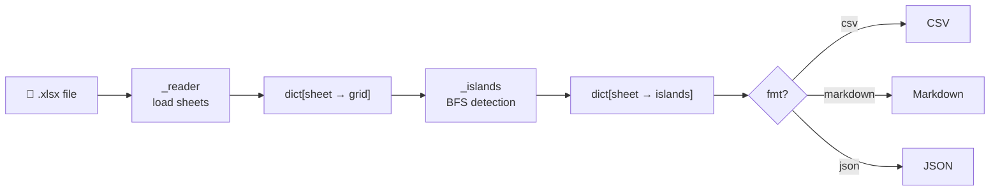

# carloforte

Extract structured data from Excel files with minimal token usage.

carloforte uses an island-detection algorithm to convert Excel sheets into a compact intermediate representation (CSV, Markdown, or JSON), making it efficient to pass spreadsheet data to LLMs.

## Installation
``uv add carloforte``

## Usage

```python
import carloforte

# Extract all sheets as CSV (default)
text = carloforte.extract("data.xlsx")

# Extract specific sheets as Markdown
text = carloforte.extract("data.xlsx", sheets=["Revenue", "Costs"], fmt="markdown")

# Extract as JSON
text = carloforte.extract("data.xlsx", fmt="json")
```

### Formats

| Format | Best for |
|--------|----------|
| `csv` | Compact, low token count |
| `markdown` | Readable, good for LLM prompts |
| `json` | Structured output, programmatic use |

### CLI

```bash
carloforte data.xlsx --fmt markdown
carloforte data.xlsx --sheets Revenue Costs --fmt json
```

## How it works

Excel sheets often contain multiple disconnected tables, empty rows, and metadata scattered around. carloforte detects each contiguous block of data ("island") independently and serialises only what matters — reducing token usage by 60–75% compared to passing raw Excel content to an LLM.

## Performance

Benchmarked against raw CSV export (worst case baseline):

| File | Raw CSV | CSV island | Markdown | JSON | Best reduction |
|------|--------:|-----------:|---------:|-----:|---------------|
| big_sample.xlsx | 4,484 | 974 | 1,465 | 1,351 | **-78.3%** |
| chaos.xlsx | 10,529 | 4,676 | 6,550 | 6,086 | **-55.6%** |
| messy_sample.xlsx | 2,142 | 1,457 | 2,175 | 1,993 | **-32.0%** |
| multisheet_sample.xlsx | 1,292 | 1,144 | 1,874 | 1,748 | **-11.5%** |
| sample.xlsx | 248 | 244 | 416 | 380 | **-1.6%** |
| very_messy_populated.xlsx | 22,681 | 21,254 | 27,974 | 27,445 | **-6.4%** |

*Chars used as proxy for token count. CSV island format is the most compact in all tested cases.*

## Architecture



## License

MIT
