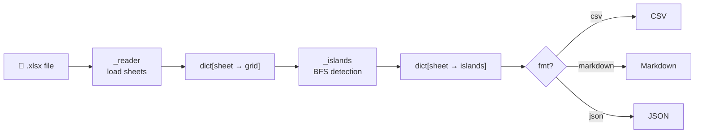

# carloforte

Extract structured data from Excel files with minimal token usage.

carloforte uses an island-detection algorithm to convert Excel sheets into a compact intermediate representation (CSV, Markdown, or JSON), making it efficient to pass spreadsheet data to LLMs.

## Installation
TBC

## Usage

```python
import carloforte

# Extract all sheets as CSV (default)
text = carloforte.extract("data.xlsx")

# Extract specific sheets as Markdown
text = carloforte.extract("data.xlsx", sheets=["Revenue", "Costs"], fmt="markdown")

# Extract as JSON
text = carloforte.extract("data.xlsx", fmt="json")
```

### Formats

| Format | Best for |
|--------|----------|
| `csv` | Compact, low token count |
| `markdown` | Readable, good for LLM prompts |
| `json` | Structured output, programmatic use |

### CLI

```bash
carloforte data.xlsx --fmt markdown
carloforte data.xlsx --sheets Revenue Costs --fmt json
```

## How it works

Excel sheets often contain multiple disconnected tables, empty rows, and metadata scattered around. carloforte detects each contiguous block of data ("island") independently and serialises only what matters — reducing token usage by 60–75% compared to passing raw Excel content to an LLM.

## Architecture



## License

MIT
